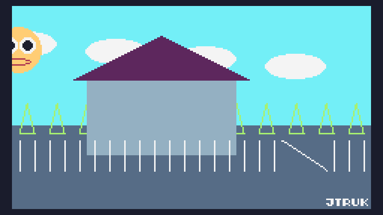

# Drawing in TIC-80, using the Lua language

This a short tutorial to introduce some basics. It is designed to give a nice shape for a workshop (30-90 minutes, depending on capability and how much you'd like to play around) or something to follow for a basic self-start.

It covers:
- Comments in code.
- The structure of a program.
- Running a program.
- Built-in functions.
- The basic shapes you can draw with TIC-80.
- The colour palette.
- Some control structures (`if` statements and `for` loops).
- User-defined functions.
- Time and basic animation.
- Modulo (`%`)
- Using the sine function to animate over time.

It may be helpful to first read [about TIC-80](../about-tic-80.md) and how to [install and customise it](../setup-tic-80.md)

## Comments

We'll sprinkle some comments in the code to signpost or explain bits of the functionality.

Comments start with two minus signs (`--`). TIC-80 will print them in a different colour (by default: dark grey)

```lua
-- Comments look like this

-- You might like to run your comments over a few lines if they'd
-- otherwise run off the width of the screen
```

You can choose to add your own comments, or remove the ones I've written, without affecting how the program runs.

There's an art to knowing when to comment - too much commenting can confuse the code, but there should be enough so that someone new (or yourself in a year's time) can quickly understand what it does or any unusual-looking decisions. As a short-hand rule, don't comment any code that explains itself.

## The code editor window

When you first start TIC-80, you'll get a command line, and a suggestion to type 'help' (and press enter).

Press 'Esc` to switch to the Code Editor.

The Code Editor will contain some starter code, which will include:

```lua
function TIC()
```

### Run the default code

To run this code, press CTRL-R (or equivalent on your OS).

[Assuming you have configured Dev Mode](../setup-tic-80.md) you can press `ESC` to stop the program and switch back into the code editor.

You should get used to this flow. You'll be using it a lot! 

### Other editors

TIC-80 includes a few tools; for designing 2D graphics and sound. We won't be using these in this exercise, but you can switch between them with the `F2`-`F5` keys to take a look:

- `F2` - Sprite editor
- `F3` - Map editor
- `F4` - Sound editor
- `F5` - Music editor

Most importantly, `F1` returns you back to the code editor if you accidentally switch.

## Errors and the minimum viable program

### Clear the default code

You should remove the default example code. You can do this by selecting all (CTRL-A or your OS' equivalent) and pressing the `backspace` key

### Errors

TIC-80 will check whether some specific functions are defined in your code and handle them specially. The only one that's necessary is `TIC`. This must be spelt exactly, and written in capitals.

Without this function (or if you've misspelt it), running the program will give you a little unhappy error.

Try this so that you can become familiar with errors! They look a bit confusing, but most of the time they give clues as to how to investigate and solve them.

The important thing is not to be anxious about errors in TIC-80. They just tell you that something isn't right and that your program had to stop running. They may look angry but they're actually (supposed to be) helpful!

Trying to run without `TIC()` shows the following error:

`'function TIC()...' isn't found :(`

Often the error will include a line number to help your investigation.

### Create the TIC function

Update the code in the editor to read:

```lua
function TIC()
end
```

If you run that program, it will look like nothing is happening, but your code is running - you haven't instructed TIC-80 to clear the screen, so it is still showing whatever was there before - the code in the Code Editor.

## Indenting (for your sanity) and Built-in functions

The way you layout your code is very important, so that you can get visual clues as to how bits of the code are grouped together.

Mostly, spacing doesn't matter to the computer in Lua - it's just for you.

We use newlines to try to keep one useful thing to each row of code, and spaces to line up grouped things in columns.

For the latter - horizontal spacing - You can use spaces or tabs. Tabs in TIC-80 are one space, so you won't see any difference between spaces and tabs, but you might do if you copy the code elsewhere, which is a bit annoying!

Coders develop their own styles and try to match them when working together. I'll suggest my style here, but you're welcome to use your own.

I indent code within a function by one space.

Code within a control structure (an `if` or a `for` - we'll come on to these - is also indented by one space)

Comments should be indented so that they neatly match, by column, the code they reference.

We'll start by clearing the screen, so modify the code to be:

```lua
function TIC()
	cls()
end
```

When you run that, the code from the code editor should be wiped from the screen. Pressing `ESC` will return you to the editor again. 

`cls` is one of TIC-80's built-in functions. You must provide the brackets, and some functions take arguments. `cls` is a bit unusual in that it takes an optional argument, a colour index. If you don't include a number, it'll default to 0, which is black, but you can try other numbers from 1 to 15 to wipe the whole screen to a single colour, e.g. light blue for sky:

```lua
function TIC()
	cls(11)
end
```

## Drawing Shapes

We'll cover a few built-in functions that allow you to draw on the screen:

- `pix`
- `rect`
- `line`
- `tri`
- `circ`
- `rectb`, `trib`,`circb`, and `ellib`
- `print`

We'll start with the smallest...

### pix(x,y, colour)

A pixel is a "picture element", and can be set to one of TIC-80's 16 colours.

The screen is made from a grid of pixels - coloured dots that form the image.

TIC-80's screen is 240 pixels wide by 136 pixels high.

You can set a pixel by calling the `pix` function. This takes three arguments, `x` (the horizontal position of the pixel in the grid, from 0-239), `y` (the vertical position, from 0-135), and a colour index (between 0 and 15).

Try setting a pixel on the screen:

```lua
function TIC()
	-- Clear the screen to a sky-coloured background
	cls(11)

	-- Set a pixel in the centre of the screen to white 
	pix(120,68, 12)
end
```

### rect(x,y, w,h, colour) and draw order

This function will draw a rectangle. Remove the `pix()` call, to swap it for a `rect()` call.

Make sure you supply all the required arguments in brackets, or you may get an error.

Also note that you're supplying a width and height, rather than a second x,y coordinate to draw to.

Ensure you pay attention to the order of the arguments!

```lua
function TIC()
	-- Clear the screen to a sky-coloured background
	cls(11)

	-- Grass
	rect(0,80, 240,60, 6)
end
```

We'll draw another rectangle. Try putting this above the grass in your code:

```lua
	-- House
	rect(50,50, 100,50, 13)
```

That's not quite as we'd like it. The house is sitting directly on the horizon rather than the grass. Now move that 'house' rectangle below the grass rectangle. The code should now look like:

```lua
function TIC()
	-- Clear the screen to a sky-coloured background
	cls(11)

	-- Grass
	rect(0,80, 240,60, 6)

	-- House
	rect(50,50, 100,50, 13)
end
```

The program runs sequentially through the TIC function. Whatever you tell it to do higher up will be done first - You can define functions wherever you like, but they won't be executed until you call them, so we need to call the draw functions in the intended order.

### Variables

As we've seen, the position of the house is relative to the position of the horizon, so it might be good to tie these placements together - so if we want to change where they both are, we can do that in one place.

We can do this using a `variable`. Variables are ... that hold values

### tri(x1,y1, x2,y2, x3,y3, colour) and the default colour palette

We'll continue to build the scene, so add the following after your 'house' rectangle, but before the `end` of the function:

```lua
	-- Roof
	tri(100,20, 40,50, 160,50, 1)
```

`tri` draws a triangle, taking three positions on screen (one for each corner) and a colour index.

The first coordinate here is the top centre point of the triangle, and the next two are the bottom of the triangle, left and right.

You're welcome (actually: encouraged) to tweak the values yourself. Change the positions a little bit, or choose a different colour index.

If you'd like to see the available colours, press `F2` to enter the sprite editor. At the bottom left is the colour palette. You can hover the mouse cursor over each colour to see which colour index you should use. I've chosen `1`  for the roof, which is purple.

### line(x1,y1, x2,y2, colour) and for loops

We're going to add a fence, and to do that we'll need some fenceposts. We'll do that at the bottom of our function (but before the function `end`)

One fencepost might look like this:

```lua
	-- Fence
	line(100,90, 100,110, 12)
```

We'll need about twenty fenceposts, but we can use a loop to save us the trouble of writing code for each one:

```lua
	-- Fence
	for xPos=5,240,10 do
		line(xPos,90, xPos,110, 12)
	end
```

A for loop specifies a variable (`xPos`). This variable is modified each time the loop runs. It can take three arguments. These are:
- A value to start from (`xPos` starts at this value)
- A value that we finish at if the variable (`xPos`) exceeds it.
- A value to increse the variable by on each iteration of the loop (this defaults to `1` if it is not supplied)

So the code above will start drawing fenceposts at `xPos`==`5`, incrementing `xPos` by `10`, and finishing when `xPos`>240. 

### if condition

We'll wrap a condition inside this loop. Everytime the loop runs, the condition is tested. If the condition succeeds, then the code inside the condition runs:

```lua
	-- Fence
	for xPos=5,240,10 do
		if xPos<180 or xPos>210 then
			line(xPos,90, xPos,110, 12)
		end
	end
```

So, the fenceposts will be drawn only when `xPos` < `180` or `xPos` > `210`, leaving a little gap.

We'll fill this gap (and prove that lines don't need to be vertical, by adding a 'gate' after the 'fence' code)

```lua
	-- Gate
	line(180,90, 210,110, 13)
```

### circ(x,y, r, colour), user-defined functions, and nested functions

Time to add the sun, after the 'grass', but before the 'house'

```lua
	-- The sun
	circ(200,30, 15, 4)
```

We can define our own functions to help keep code cleaner - as an example of this, we'll split the sun-drawing off into it's own function.

Below the rest of the code (after the `end` of the `TIC()` function, create your own function like this:

```lua
function drawSun(x,y)
	circ(x,y, 15, 4)
end
```

and replace your:
```lua
	-- The sun
	circ(200,30, 15, 4)
```

with:
```lua
	-- The sun
	drawSun(200,30)
```

The new `drawSun` function receives an `x` and `y` value as `variables` when it is called from `TIC()` and passes their values into `circ`, to draw a circle - this should look like it did before.

We can then fill out that `drawSun` function to do a little more, including calling another of our functions a couple of times: 

```lua
function drawSun(x,y)
	circ(x,y, 15,4)

	local eyeY=y-3
	drawEye(x-6,eyeY)
	drawEye(x+6,eyeY)

	local mouthH=3+math.sin(T*.2)*2
	ellib(x,y+8, 8,mouthH, 2)
end

function drawEye(x,y)
	circ(x,y, 5,12)
	circ(x,y, 3,0)
end
```

### Draw some clouds

(...)

### `trib`, `rectb`, `circb`, `ellib`

Our three shape functions have unfilled / border-only equivalents. They take the same number of arguments as their filled counterparts.

We'll add a row of trees above 'house' so that they appear behind it:

```lua
	-- Trees
	for x=10,240,20 do
		trib(x,65, x-5,85, x+5,85, 5)
	end
```

### print(string, x,y, colour) and Sign your masterpiece!

Place this at the end of your `TIC()` function, replacing "JTRUK" with your own name, and adjusting the `210` so that your name fits nicely on the screen:

```lua
	-- Sign it!
	print("JTRUK", 210,129, 12)
```

## The Full Scene

```lua
T=0 -- Time
HOR_Y=80 -- The y-position of the horizon

function TIC()
	-- Clear the screen to a sky-coloured background
	cls(11)

	-- Some clouds
	for i=1,4 do
		local cloudX=(-T/3 + i*60)%240
		local cloudY=HOR_Y-50 + i*5
		drawCloud(cloudX,cloudY)
	end
	
	-- A chatty sun
	local sunX=T%240
	local sunY=HOR_Y - 45 + math.sin(T/10)*15
	drawSun(sunX,sunY)

	-- Grass
	rect(0,HOR_Y, 240,136-HOR_Y, 6)

	-- Trees
	local treeY=HOR_Y+5
	local treeH=20
	for treeX=10,240,20 do
	 drawTree(treeX,treeY, treeH)
	end

	-- House
	local houseY=HOR_Y-30
	rect(50,houseY, 100,50, 13)

	-- Roof
	tri(100,houseY-30, 40,houseY, 160,houseY, 1)

	-- Fence
	local fenceY1=HOR_Y+10
	local fenceY2=fenceY1+20
	local gateX1=160
	local gateX2=gateX1+30
	for fenceX=5,240,10 do
		if fenceX<gateX1 or fenceX>gateX2 then
			line(fenceX,fenceY1, fenceX,fenceY2, 12)
		end
	end

	-- Gate
	line(gateX1,fenceY1, gateX2,fenceY2, 13)
	
	-- Sign it!
	print("JTRUK", 210,129, 12)
	
	T=T+1
end

function drawSun(x,y)
	circ(x,y, 15, 4)

	local eyeY=y-3
	drawEye(x-6,eyeY)
	drawEye(x+6,eyeY)

	local mouthH=3 + math.sin(T/5)*2
	ellib(x,y+8, 8,mouthH, 2)
end

function drawEye(x,y)
	circ(x,y, 5, 12)
	circ(x,y, 3, 0)
end

function drawCloud(x,y)
	elli(x,y, 20,8, 12)
end

function drawTree(xPos, treeY, treeH)
	trib(xPos,treeY-treeH, xPos-5,treeY, xPos+5,treeY, 5)
end
```



## Loading and saving

folder

gif

xxx